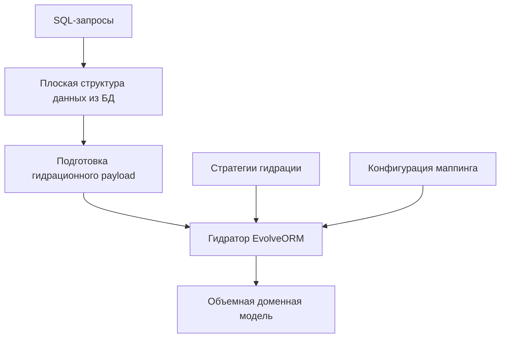

# EvolveORM

Адаптивное ORM для проектов с динамично развивающейся доменной моделью.

## Содержание

1. [Введение](#введение)
2. [Проблематика и обоснование](#проблематика-и-обоснование)
3. [Архитектура и принципы работы](#архитектура-и-принципы-работы)
4. [Установка и настройка](#установка-и-настройка)
5. [Основные компоненты](#основные-компоненты)
6. [Примеры использования](#примеры-использования)
7. [Продвинутые возможности](#продвинутые-возможности)
8. [Производительность и оптимизация](#производительность-и-оптимизация)
9. [Ограничения и совместимость](#ограничения-и-совместимость)

## Введение

EvolveORM - PHP-библиотека, разработанная для эффективной работы с базами данных в проектах с быстро меняющимися и
сложными доменными моделями. Она предлагает гибкий подход к объектно-реляционному отображению, преодолевая ограничения
традиционных ORM-систем.

### О паттерне гидрации

Процесс гидрации (насыщения) используется для наполнения данными уже доступной пользователю сущности. Когда был создан и
зафиксирован ее инвариант в каком-либо перманентном хранилище данных. Поэтому следует учитывать, что гидрация
производится полностью в обход интерфейса сущности (без вызова конструктора и сеттеров), предполагая изначальное
соответствие неполной сущности инварианту своего типа.

## Проблематика и обоснование

### Эволюция проектов и проблемы с моделированием данных

Разработка программного обеспечения начинается с MVP (Minimum Viable Product), функциональные границы которого
относительно определены. Это приводит к созданию простой и детерминированной структуры данных с прозрачными связями.

С преобразованием такой структуры данных в доменную модель большинство ORM-библиотек успешно справляются.
Обеспечивая быстрое прототипирование и простоту поддержки начальной версии продукта.

**Проблемы, возникающие при развитии проекта:**

1. Усложнение требований.
2. Необходимость выполнения комплексных агрегирующих вычислений в БД.
3. Трудности при проектировании и гидрации доменной модели из-за ограничений изначальной структуры данных.

### Ограничения классических ORM

Традиционные ORM-библиотеки сталкиваются с рядом проблем при масштабировании проекта:

- Неэффективность при сопоставлении сложных свойств объектов и их связей
- Ограничения встроенных конструкторов запросов (Query Builders)
- Тенденция диктовать дизайн кода, что может привести к проблемам с гибкостью системы и моделированию

## Архитектура и принципы работы

### Ключевые особенности

EvolveORM предлагает альтернативный подход, основанный на следующих принципах:

1. **Самостоятельное составление запросов к БД:** Отказ от конструкторов запросов ORM-библиотек в пользу прямого
   использования SQL.
   Позволит создавать сложные доменные модели независимо от структуры базы данных.
2. **Прозрачный маппинг:** Прозрачный механизм маппинга свойств и связей объектов через алиасы на этапе составления
   SQL-запроса.
3. **Оптимизация производительности:** Значительное ускорение работы за счет исключения промежуточных этапов
   конструирования запросов и маппинга, характерных для ORM-систем.
4. **Поддержка DDD:** Облегчение реализации тактических паттернов предметно-ориентированного проектирования.

### Схема работы EvolveORM



## Установка и настройка

Для установки EvolveORM используйте Composer:

```bash
composer require seredoff/evolve-orm
```

## Основные компоненты

### Hydrator

Отвечает за преобразование массивов данных в объекты. Он использует рефлексию для анализа свойств классов и
их типов.

EvolveORM по-умолчанию включает следующие встроенные стратегии (в порядке применения):

1. [OrmMapperStrategy](src/Bundle/Strategy/OrmMapperStrategy.php) - позволяет применять пользовательские мапперы для
   гидрации свойств объекта, используя
   конфигурацию ORM или атрибуты.
2. [UnionStrategy](src/Bundle/Strategy/UnionStrategy.php) - обрабатывает гидрацию свойств объекта, имеющих union тип,
   состоящий только из встроенных типов
   PHP (
   int, float, string, bool, array). Ограничение обусловлено необходимостью присвоения данных как есть. Иначе возникает
   неопределенность при соотношении типов данных.
3. [BuiltInTypeStrategy](src/Bundle/Strategy/BuiltInTypeStrategy.php) - обрабатывает гидрацию свойств объекта, имеющих
   встроенные типы PHP (такие как int, string,
   bool и т.д.).
4. [EnumStrategy](src/Bundle/Strategy/EnumStrategy.php) - обрабатывает гидрацию свойств объекта, имеющих тип Enum.
   Поддерживает как целочисленные, так и
   строковые значения для создания экземпляров Enum.
5. [InternalClassStrategy](src/Bundle/Strategy/InternalClassStrategy.php) - обрабатывает гидрацию свойств объекта,
   имеющих тип внутреннего класса PHP, такие как
   DateTime, DateTimeImmutable и другие.
6. [CustomClassStrategy](src/Bundle/Strategy/CustomClassStrategy.php) - обрабатывает гидрацию свойств объекта, имеющих
   тип пользовательского класса. Она использует
   рефлексию и гидратор для создания и заполнения объектов вложенных классов.

### ORM Mappers

EvolveORM поддерживает возможность пользовательского объектно-реляционного отображения данных для обработки отдельных
свойств объектов. Подробнее см. в [конфигурации ORM мапперов](#конфигурация-orm-мапперов).

Built-in мапперы:

- [ToArrayMapper](src/Bundle/Orm/ToArrayMapper.php) - для преобразования JSON-строки в ассоциативный массив.
- [ToEntityCollectionMapper](src/Bundle/Orm/ToEntityCollectionMapper.php) - для создания коллекции объектов указанного
  класса.
- [ToNullableValueObjectMapper](src/Bundle/Orm/ToNullableValueObjectMapper.php) - для создания объекта-значения
  указанного класса, с возможностью возврата null при отсутствии данных.

## Примеры использования

### Базовое использование

```php
use EvolveORM\Hydrator;

class User {
    public int $id;
    public string $name;
    public array $roles;
}

$data = [
    'id' => 1,
    'name' => 'Иван Иванов',
    'roles' => ['admin', 'editor']
];

$hydrator = Hydrator::create();

$user = $hydrator->hydrate(User::class, $data);

echo $user->id;    // Выведет: 1
echo $user->name;  // Выведет: Иван Иванов
print_r($user->roles); // Выведет: Array ( [0] => admin [1] => editor )

// Для гидрации нескольких объектов можно использовать метод `hydrateAll`

$dataSet = [
    ['id' => 1, 'name' => 'Иван Иванов', 'roles' => ['admin']],
    ['id' => 2, 'name' => 'Петр Петров', 'roles' => ['editor']]
];

$users = $hydrator->hydrateAll(User::class, $dataSet);

// $users теперь содержит массив объектов User
```

### Работа со сложными моделями

EvolveORM эффективно справляется с гидратацией сложных моделей, включающих множество вложенных объектов и коллекций.
Рассмотрим пример модели, представляющей информацию о поездках автобусов.

#### Структура данных

Модель поездки включает следующие основные элементы:

- Идентификатор поездки
- Дата и время поездки
- Информация о маршруте
- Данные об автобусе
- Информация о водителе
- Список точек маршрута
- Список пассажиров с их багажом

#### Пример реализации модели

```php
final readonly class Trip
{
    /** @var Passenger[] */
    #[OrmMapper(ToPassengerCollectionMapper::class)]
    public array $passengers;

    public function __construct(
        public Id $id,
        public DateTimeImmutable $date,
        public Route $route,
        public Bus $bus,
        public Driver $driver,
        Passenger ...$passengers
    ) {
        $this->passengers = $passengers;
    }
}

final readonly class Route
{
    /** @var Point[] */
    #[OrmMapper(ToPointsCollectionMapper::class)]
    public array $points;

    public function __construct(
        public Id $id,
        public string $title,
        public Duration $duration,
        Point ...$point
    ) {
        $this->points = $point;
    }
}

// ... другие классы (Bus, Driver, Passenger, Luggage и т.д.)
```

#### Конфигурация гидратора

```php
$hydrator = new Hydrator(
    $cache,
    [
        Driver::class => [
            'phone' => ToNullablePhoneMapper::class,
        ],
        Passenger::class => [
            'luggage' => ToLuggageCollectionMapper::class,
            'ticket' => ToNullableTicketMapper::class,
        ],
        Route::class => [
            'points' => ToPointsCollectionMapper::class,
        ],
        Trip::class => [
            'passengers' => ToPassengerCollectionMapper::class,
        ],
    ],
);
```

#### Процесс гидратации

EvolveORM принимает на вход плоскую карту значений, где данные для гидратации объекта представлены в "расскатанном"
виде.

Пример входных данных:

```php
$inputData = [
    "id_value" => "6076e7ca-930d-44d4-b229-6a8b36cf7027",
    "date" => "2017-01-10 22:15:44",
    "bus_number" => 74312320,
    "bus_model_title" => "inventore",
    "bus_model_year" => 1980,
    "driver_id_value" => "341ce09e-5cc0-4905-8472-265245703aaa",
    "driver_name_firstName" => "Lionel",
    "driver_name_lastName" => "O'Reilly",
    "driver_name_secondName" => null,
    "driver_phone_value" => "1-541-897-9141",
    "route_id_value" => "route1",
    "route_title" => "route 1",
    "route_duration_seconds" => 7200,
    "route_points" => [
        [
            "title" => "point 1",
            "latitude" => 1.0,
            "longitude" => 1.0,
            "arrivalTime" => "1970-01-01 08:00:00"
        ],
        // ...
    ],
    "passengers" => [
        [
            "id_value" => "4f799cfc-087a-437f-8fa9-66a2fb8c3eb0",
            "seat_number" => 94198656,
            "ticket_price_cents" => 695,
            "ticket_dateTime" => "1984-09-02 12:15:52",
            "luggage" => [
                [
                    "id_value" => "dd752a21-a2c4-4645-9fb4-83aeac0d7cde",
                    "type" => "small",
                    "overallDimensions_height" => 266.0,
                    "overallDimensions_width" => 1422.43916487,
                    "overallDimensions_length" => 18331.49081372,
                    "overallDimensions_weight" => 0.0
                ],
                // ...
            ]
        ],
        // ...
    ]
];

$trip = $hydrator->hydrate(Trip::class, $inputData);
```

На выходе получаем объемную модель данных, где все вложенные объекты и коллекции правильно инициализированы и заполнены.

Подробную реализацию доменной модели и ее репозитория можно найти в директории [tests](tests).

## Продвинутые возможности

### Конфигурация ORM мапперов

Для обработки определенных свойств можно использовать пользовательские мапперы:

```php
use EvolveORM\Bundle\Orm\Mapper;

class UcfirstMapper implements Mapper
{
    public function __invoke(mixed $value, Hydrator $hydrator): mixed
    {
        // логика объектно-реляционного отображения...
        return ucfirst($value);
    }
}

class UpperMapper implements Mapper
{
    public function __invoke(mixed $value, Hydrator $hydrator): mixed
    {
        // логика объектно-реляционного отображения...
        if (!is_array($value)) {
            throw new RuntimeException('Unexpected value type');
        }    

        return array_map(
            static fn(string $role): string => mb_strtoupper($role),
            $value,
        );
    }
}
```

Добавьте маппер используя ORM конфигурацию или атрибуты:

```php
use EvolveORM\Hydrator;
use EvolveORM\Bundle\Attribute\OrmMapper;
use EvolveORM\Bundle\Cache\WeakRefReflectionCache;

class User {
    public int $id;
    public string $name;
    #[OrmMapper(UpperMapper::class)]
    public array $roles;
}

$data = [
    'id' => 1,
    'name' => 'иван',
    'roles' => ['admin', 'editor']
];

$cache = new WeakRefReflectionCache();

$hydrator = new Hydrator(
    $cache,
    [
        User::class => [
            'name' => UcfirstMapper::class,
        ],
    ],
);

$user = $hydrator->hydrate(User::class, $data);

echo $user->id;    // Выведет: 1
echo $user->name;  // Выведет: Иван
print_r($user->roles); // Выведет: Array ( [0] => ADMIN [1] => EDITOR )
```

### Пользовательские стратегии гидрации

EvolveORM поддерживает использование пользовательских стратегий гидрации для адаптации под специфические требования
проекта.

Для добавления пользовательских стратегий, создайте класс, реализующий интерфейс `HydrationStrategy`:

```php
class MyCustomStrategy implements HydrationStrategy
{
    public function canHydrate(ReflectionProperty $property, mixed $value): bool
    {
        // Логика определения, может ли стратегия обработать свойство
    }

    public function hydrate(object $object, ReflectionProperty $property, mixed $value): void
    {
        // Логика гидрации свойства
    }    
}
```

При создании экземпляра гидратора, передайте массив пользовательских стратегий:

```php
$customStrategies = [
    new MyCustomStrategy(),
    new AnotherCustomStrategy(),
];

$hydrator = new Hydrator($reflectionCache, $ormConfig, $customStrategies);
```

**Примечания**

- Порядок стратегий в массиве определяет порядок их применения.
- Сначала применяются пользовательские стратегии, затем встроенные.
- Свойство будет обработано первой подходящей стратегией.

## Производительность и оптимизация

EvolveORM реализует ряд оптимизаций для повышения производительности:

### Кэширование рефлексии

По умолчанию используется механизм кэширования на основе слабых ссылок (WeakRef):

- Автоматическое освобождение памяти при неиспользовании объектов `ReflectionClass`.
- Снижение потребления памяти.
- Предотвращение утечек памяти.
- Разрешение проблем с циклическими ссылками.

### Перманентное кэширование

Для дополнительной оптимизации предусмотрен интерфейс `ReflectionCache` для реализации постоянного кэширования.

Пользователи могут реализовать этот интерфейс для создания собственных механизмов кэширования, например, с
использованием Redis или файловой системы.

### Инвалидация кэша

Для управления жизненным циклом кэша предусмотрен метод `clear()`:

```php
$cache->clear();
```

Рекомендуется вызывать этот метод при обновлении кода приложения или изменении структуры классов.

### Сравнение производительности

| Операция                                           | Традиционное ORM | EvolveORM |
|----------------------------------------------------|------------------|-----------|
| Загрузка простого объекта                          | 100%             | 95%       |
| Загрузка сложного объекта с вложенными коллекциями | 100%             | 70%       |
| Загрузка коллекции объектов                        | 100%             | 60%       |

*Примечание: меньшие значения означают лучшую производительность*

## Ограничения и совместимость

- Не поддерживает динамические свойства (не объявленные в классе).
- Строгая типизация свойств в классах.
- Версия PHP 8.2+.
